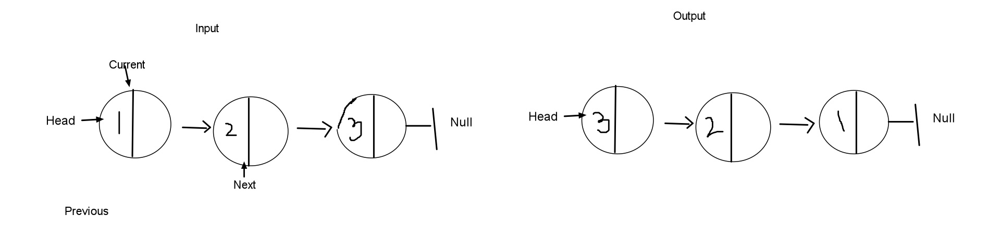

# Class 26

## Component Based UI

- Combining Concerns (not separation of concerns).
- REACT is our component library/framework. Just javascript, which creates stand alone UI components.
  - Our UIs need 4 things
    1. State (what data does our UI need)
    2. Behavior (how are our users interacting)
    3. Events (what browser/API specific things are occurring in our UI)
    4. Template (what layout does our UI use to display content?)

How did we used to do things:
[OLD WAY](./vanilla)


***

## Overview
Intro to component based UI
Start focusing more on DSA

### Code Challenge

- Write a funcion that takes in a linked list and returns a new linked list with its nodes reversed.

  - If you have completed this challenge previously: Let them know.
  - CLARIFYING QUESTIONS! Ask can I use built-in methods? Should I build methods from scratch using classes? What can I assume about nodes? Would you like me to modify the linked list in-place?
  - IDENTIFY proper inputs and outputs. "I would expect the output to look like this."
    - Pictures
    - Illustrations of data structures and using callouts to operations that need to occur.
  - Algorithm (talk with your interviewer)
    - Enumerated list of all the steps your solution will use?
    - Concise
    - EFFICIENCY (Big(O) time and space). Space and Time complexity.
    - STEP THROUGH your algorithm with your sample input/output from above.
    - You can say, "This is what I know, this is where I am a little stuck. Is there somet Code-like statements.
  - Code: produce syntactically correct code.
  - Testing and edge cases for the end.
  - Pivoting: you hit something that does not work - talk about it. Do not freeze up. Say, "Can you see a place where I went wrong?" Ask many questions and a suggestion.

GO!

#### Questions: 

* Will the list I am given have at least one node?

#### Visualization
* 3 pointers


```js
'use strict';

class LinkedList {
  constructor(){
    this.head = null;
  }
}

class Node(value){
  constructor(){
    this.value= value;
    this.next = null;
  }
}


//Inputs: LinkedList
//Outputs: New linked list in reverse

// Algorithm:
//1. Declare some variables for pointers
//2. Traverse our list
//3. Reassigning pointers for each iterration of our while loop
//4. Return  new linkedlist

// Pseudo Code:
// Declare Variables:
// * var previous
// * var next
// * var current = linkedList.head;
// Traverse list:
// * while (current !== null) --> reassign
     //* next = current.next
     //*current.next = previous

// Move pointers one step in the direction we want
     //* previous = current
     //* current = next

// Code


```
